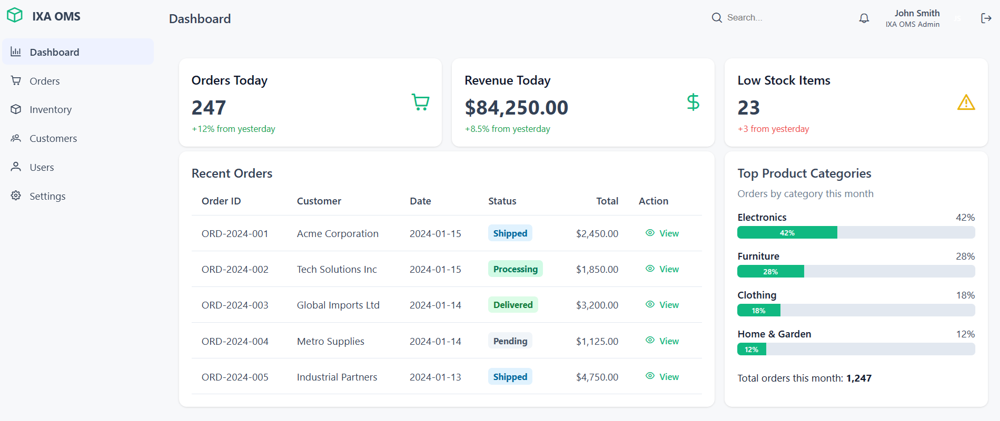

# IXA OMS


IXA OMS (Order Management System) is a web-based application built with Angular (v20.1.5) and PrimeNG (v20.x) for managing orders, inventory, customers, users, and settings. It is designed to be modular, scalable, and maintainable.


<p align="center">
  
</p>

## Features

- **Authentication**: Secure login, JWT-based session, and route protection.
- **Dashboard**: Overview of key metrics, charts, and quick navigation.
- **Order Management**: Create, view, update, delete orders, and preview invoices.
- **Customer Management**: Add, edit, delete, and list customers with dialog forms.
- **Inventory Management**: Track, add, edit, and list inventory items.
- **User Management**: Manage user accounts, roles, and permissions.
- **Settings**: Configure application preferences and roles.
- **Responsive Layout**: Dashboard, header, and sidebar components for a modern UI.
- **UI Components**: Built with [PrimeNG](https://primeng.org/) for rich UI elements (tables, dialogs, forms, etc).


## Project Structure

```
.
	src/
		app/
			core/			# Core services, guards, models
			features/		# Feature modules (auth, customers, dashboard, inventory, layout, orders, settings, users)
			shared/			# Shared types and utilities
			app.config.ts	# App configuration (routing, PrimeNG theme, etc.)
			app.routes.ts
		index.html			# App index (document shell)
		main.ts				# Angular bootstrap entry
		styles.scss			# Global styles (PrimeFlex, PrimeIcons imports)
	public/					# Static assets (configured in angular.json)
	angular.json
	package.json
```


## Getting Started

### Prerequisites
- Node.js (v18+ recommended)
- npm (v9+ recommended)
- Angular CLI (`npm install -g @angular/cli`)


### Installation
1. Clone the repository:
	```sh
	git clone https://github.com/your-org/ixa-oms.git
	cd ixa-oms
	```
2. Install dependencies:
	```sh
	npm install
	```
3. (Optional) Install Angular CLI globally if not present:
	```sh
	npm install -g @angular/cli
	```


### Running the Application
Start the development server:
```sh
npm start
```
The app will be available at `http://localhost:4200`.


### Running Tests
- **Unit tests** (Karma/Jasmine):
```sh
npm test
```
- **End-to-end tests**: Not configured in this repository.


## Configuration
- **Main configuration files**:
	- `angular.json`: Angular workspace configuration (assets, styles, build)
	- `tsconfig.json`: TypeScript configuration
	- `src/app/app.config.ts`: App configuration (routing, global providers, PrimeNG theme)

- **Theming (PrimeNG v20)**:
	- The app uses `providePrimeNG` with the `Aura` preset from `@primeuix/themes`:
		```ts
		// src/app/app.config.ts
		import { providePrimeNG } from 'primeng/config';
		import Aura from '@primeuix/themes/aura';
		
		providePrimeNG({ theme: { preset: Aura } });
		```
	- Global styles import icons and PrimeFlex in `src/styles.scss`.


## License
This project is licensed under the MIT License.